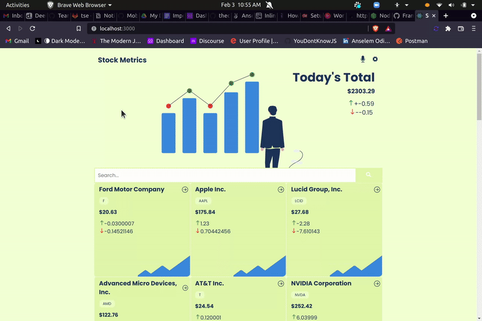

# Stock Metrics

> Stock metrics is a web(mobile-focused) app for checking the companies listed on the stoc exchange and see their live metrics. Its data is consumed from the Financial modelling API. It is built using React, Redux, and Styled Components, Framer Motion. 
> 

 

# Mini Demo 

# Live Demo
